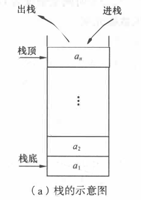
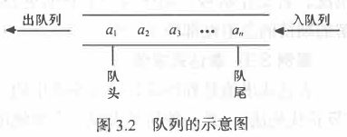
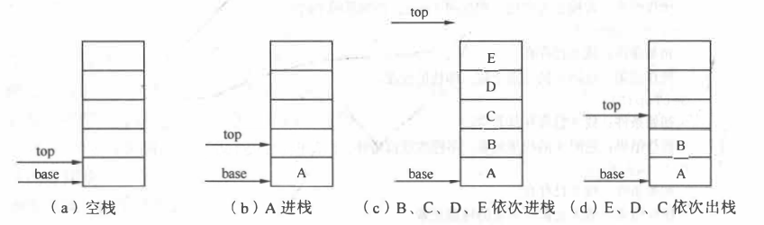
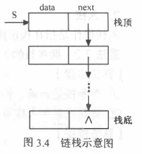

# 数据结构学习

## 第三章 栈和队列

#### 定义

* *栈** (stack) 是限定仅在表尾进行插入或删除操作的线性表。因此， 对栈来说， 表尾端有其
  特殊含义， 称为**栈顶** (top), 相应地， 表头端称为**栈底** (bottom) 。 不含元素的空表称为**空栈**。
* **队列**(queue)是一种先进先出(First In First Out, FIFO)的线性表。它只允许在表
  的一端进行插入，而在另一端删除元素。这和日常生活中的排队是一致的，最早进入队列的元素最早
  离开。在队列中，允许插入的一端称为**队尾**(rear), 允许删除的一端则称为**队头**(front)。

#### 特点

* **栈**：先进后出、后进先出（吃进去，吐出来）
* **队列**：先进先出、后进后出（吃进去，拉出来）

#### 图示

**栈：**

**队列：**

### 顺序栈

#### 存储结构

~~~c
typedef struct {
    SElement *base;     //栈底指针
    SElement *top;      //栈顶指针
    int stacksize;      //栈可用最大容量
}SqStack;
~~~

#### 栈指针图示

#### 注意点

* 增加元素前，需先检查顺序栈空间是否已满
* 删除元素前，需检查顺序栈是否为空
* 若栈底指针和栈顶指针指向同一位置，则说明栈空
* 若栈顶指针和栈底指针之差大于等于MAXSIZE，则栈满

### 链栈

#### 存储结构

~~~c++
typedef struct StackNode{
    Element data;
    struct StackNode *next;
}StackNode,*LinkStack;
~~~

> 说明：StackNode 和 \*LinkStack 实质上没有区别，仅仅是为了方便记忆， \*LinkStack 一般用来指链栈的栈顶地址，而StackNode 用来指普通的 StackNode 数据类型。

### 指针图示

### 注意点：

* 为方便起见链表的头部作为栈顶
* 在出栈之后，需要释放出此栈元素的空间
* 每次出栈/入栈后需要更新栈顶的指针指向
* 通过验证栈顶是否为NULL来判断链栈是否为空

