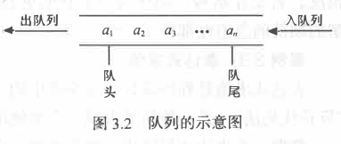
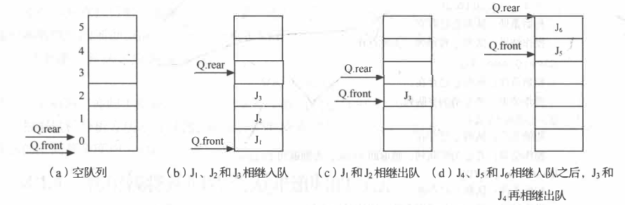
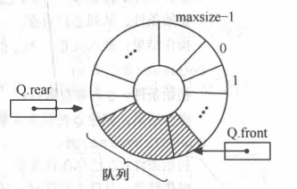
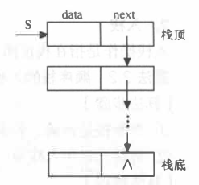
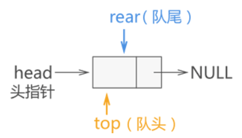
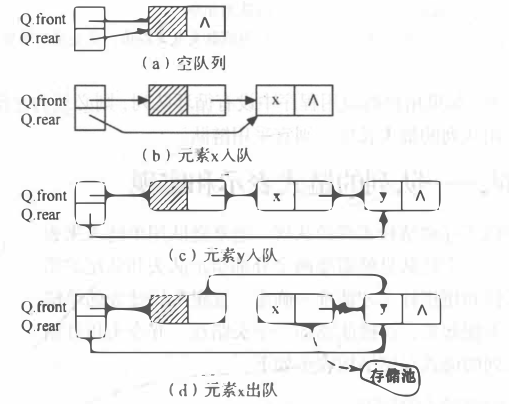

## 第三章 栈与队列

### 3.1 关于栈

#### 3.1.1 栈定义及特点

栈是用来存储逻辑关系为 "一对一" 数据的线性存储结构，如图所示：

从图中看到，栈存储结构与之前所学的线性存储结构有所差异，这缘于栈对数据 "存" 和 "取" 的过程有特殊的要求：

1. 栈只能从表的一端存取数据，另一端是封闭的，如图所示；
2. 在栈中，无论是存数据还是取数据，都必须遵循"先进后出"的原则，即最先进栈的元素最后出栈。拿图的栈来说，从图中数据的存储状态可判断出，元素 1 是最先进的栈。因此，当需要从栈中取出元素 1 时，根据"先进后出"的原则，需提前将元素 3 和元素 2 从栈中取出，然后才能成功取出元素 1。

因此，我们可以给栈下一个定义，即**栈是一种只能从表的一端存取数据且遵循 "先进后出" 原则的线性存储结构**。

通常，栈的开口端被称为栈顶；相应地，封口端被称为栈底。因此，栈顶元素指的就是距离栈顶最近的元素，拿图来说，栈顶元素为元素 4；同理，栈底元素指的是位于栈最底部的元素，图中的栈底元素为元素 1。

#### 3.1.2 进栈和出栈

基于栈结构的特点，在实际应用中，通常只会对栈执行以下两种操作：

- 向栈中添加元素，此过程被称为"进栈"（入栈或压栈）；
- 从栈中提取出指定元素，此过程被称为"出栈"（或弹栈）；

#### 3.1.3 栈的具体实现

栈是一种 "特殊" 的线性存储结构，因此栈的具体实现有以下两种方式：

1. **顺序栈**：采用顺序存储结构可以模拟栈存储数据的特点，从而实现栈存储结构；
2. **链栈**：采用链式存储结构实现栈结构；

**顺序栈**，即用<u>顺序表</u>实现栈存储结构。仔细观察顺序表（底层实现是**数组**）和栈结构就会发现，它们存储数据的方式高度相似，只不过栈对数据的存取过程有特殊的限制，而顺序表没有。

**顺序栈存储结构**如下：

~~~C
typedef struct {
    SElement *base;     //栈底指针
    SElement *top;      //栈顶指针
    int stacksize;      //栈可用最大容量
}SqStack;
~~~

例如，先使用顺序表（a 数组）存储 `{1,2,3,4}`，存储状态如图所示：

同样，使用栈存储结构存储 `{1,2,3,4}`，其存储状态如图所示：

使用顺序表模拟栈结构，只需要将数据从 a 数组下标为 0 的位置依次存储即可。

#### 3.1.4 顺序栈"入栈"

**算法步骤**：

1. 判断栈是否满， 若满则返回ERROR。
2. 将新元素压入栈顶， 栈顶指针加1

**算法实现**：

~~~C++
Status Push(SqStack &S,SElement e){
    //先判断栈是否满， 若满则返回ERROR。
    if (S.top-S.base >= S.stacksize)
        return ERROR;
    //再将新元素压入栈顶， 栈顶指针加1。
    *S.top++ = e;
    
    return OK;
}
~~~

#### 3.1.5 顺序栈的“出栈”

**算法步骤**：

1. 判断栈是否空， 若空则返回ERROR。
2. 栈顶指针减1, 栈顶元素出栈。

**算法实现**：

~~~C++
Status Pop(SqStack &S,SElement &e){
    //先判断栈是否空， 若空则返回ERROR。
    if (S.top == S.base)
        return ERROR;

    //栈顶指针减1, 栈顶元素出栈。
    e = *--S.top;
    return OK;
}
~~~

---

#### 3.1.6 链栈基本操作

**链栈**，即用<u>链表</u>实现栈存储结构。链栈的实现思路同顺序栈类似，顺序栈是将数顺序表（数组）的一端作为栈底，另一端为栈顶；链栈也如此，通常我们将链表的头部作为栈顶，尾部作为栈底，如图所示：

> 将链表头部作为栈顶的一端，可以避免在实现数据 "入栈" 和 "出栈" 操作时做大量遍历链表的耗时操作。

- 在实现数据"入栈"操作时，需要将数据从链表的头部插入；
- 在实现数据"出栈"操作时，需要删除链表头部的首元节点；

**因此，链栈实际上就是一个只能采用头插法插入或删除数据的链表。**

**链栈存储结构**如下：

~~~C++
typedef struct StackNode{
    Element data;
    struct StackNode *next;
}StackNode,*LinkStack;
~~~

#### 3.1.7链栈元素入栈

和顺序栈的入栈操作不同的是， 链栈在入栈前不需要判断栈是否满，只需要为入栈元素动态分配 一 个结点空间。

**算法实现**：

~~~C++
Status Push(LinkStack &S,Element e){
    //为入栈元素 e 分配空间， 用指针 p 指向。
    StackNode *p = new StackNode;
    //将新结点数据域置为e。
    p->data = e;
    //将新结点插入栈顶。
    p->next = S;
    //修改栈顶指针为 p
    S = p;
    return OK;
}
~~~

#### 3.1.8 链栈元素出栈

和顺序栈一样， 链栈在出栈前也需要判断栈是否为空， 不同的是， 链栈在出栈后需要释放出栈元素的栈顶空间。

**算法实现**：

~~~C++
Status Pop(LinkStack &S,Element &e){
    //判断栈是否为空 ， 若空则返回ERROR。
    if (S == NULL)
        return ERROR;
    //将栈顶元素赋给e。
    e = S->data;
    //临时保存栈顶元素的空间， 以备释放。
    StackNode *p = S;
    //修改栈顶指针， 指向新的栈顶元素。
    S = S->next;
    //释放原栈顶元素的空间。
    delete p;
    return OK;
}
~~~

---

### 3.2 关于队列

#### 3.2.1  队列的定义及特点

和栈相反，**队列**(queue)是一种**先进先出**(First In First Out, FIFO)的线性表。与栈结构不同的是，队列的两端都"开口"，要求数据只能从一端进，从另一端出。如图所示：

> 通常，称进数据的一端为 "队尾"，出数据的一端为 "队头"，数据元素进队列的过程称为 "入队"，出队列的过程称为 "出队"。

不仅如此，队列中数据的进出要遵循 "**先进先出**" 的原则，即最先进队列的数据元素，同样要最先出队列。在上图中，a1先进，其次是a2,a3…，则可知，a1最先出队，接下来是a2，依次出队。

> 栈和队列的区别记忆技巧：
>
> 1. 栈是吃进去，吐出来；队列是吃进去，拉出来。
> 2. 栈是只有一端封口的管子，先进后出；队列是两端开口的管子，先进先出。

#### 3.2.2 队列的实现

队列存储结构的实现有以下两种方式：

1. **顺序队列**：在<u>顺序表</u>的基础上实现的队列结构；
2. **链队列**：在<u>链表</u>的基础上实现的队列结构；

##### 顺序队列

由于顺序队列的底层使用的是<u>数组</u>，因此需预先申请一块足够大的内存空间初始化顺序队列。除此之外，为了满足顺序队列中数据从队尾进，队头出且先进先出的要求，我们还需要定义两个指针（top 和 rear）分别用于指向顺序队列中的队头元素和队尾元素

存储结构：

~~~C++
typedef struct{
    QElemType *base;        //存储空间的基地址
    int front;              //头指针
    int rear;               //尾指针
}SqQueue;
~~~

1. **简单实现**：

初始化创建空队列时，令 front = rear = 0 , 每当插入新的队列尾元素时，尾指针 rear 增 1; 每当删除队列头元素时 ， 头指针 front 增 1 。因此，在非空队列中，头指针始终指向队列头元素，而尾指针始终指向队列尾元素的下 一 个位置。如图所示：

> 当队列处于图 3.12(d) 所示的状态时不可再继续插入新的队尾元素，否则会出现**假溢出**现象。

2. **循环队列**实现

   为了避免 1 中的弊端，课通过循环队列的实现方法来避免 “假溢出” 问题。如图所示：

   

此时又出现了一个问题，当头、尾指针的值相同时，即可能是 “队满” 也可能是 “队空” 。为解决此问题，较为常用的解决方案是，少用一个元素空间。即，当存储了 MAXSIZE-1 个元素时，就判定其已满。判断条件如下：

* 队空条件：Q.front == Q.rear
* 队满条件：(Q.rear + 1) % MAXSIZE == Q.front

##### 链队列

链式队列的实现思想同[顺序队列](http://data.biancheng.net/view/173.html)类似，只需创建两个指针（命名为 top 和 rear）分别指向链表中队列的队头元素和队尾元素。链栈结构和初试状态分别如图所示：

          

#### 3.2.3 循环队列的 "入队"

**算法步骤**：

1. 判断队列是否满，若满则返回ERROR
2. 将新元素插入队尾
3. 队尾指针加l

**算法描述**：

~~~C++
Status EnQueue (SqQueue &Q, QElemType e){
    if ((Q. rear+1) %MAXSIZE == Q. front)       //尾指针在循环意义上加1后等于头指针，表明队满
        return ERROR;
    
    Q.base[Q.rear] = e;
    
    Q.rear=(Q.rear+1)%MAXSIZE;
    return OK;
}
~~~

#### 3.2.4 循环队列的 "出队"

**算法步骤**：

1. 判断队列是否为空，若空则返回ERROR
2. 保存队头元素
3. 队头指针加1

**算法描述**：

~~~C++
Status DeQueue (SqQueue &Q, QElemType &e){
    if(Q.front == Q. rear)
        return ERROR;
    
    e = Q.base[Q.front];
    
    Q.front = (Q.front+1)%MAXSIZE;
    return OK;
}
~~~

---

#### 3.2.5 链队列的"入队"

和循环队列的入队操作不同的是，链队在入队前不需要判断队是否满，需要为入队元素动态分配一个结点空间。如图所示：

**算法步骤**：

1. 为入队元素分配结点空间，用指针p指向
2. 将新结点数据域置为e
3. 将新结点插入到队尾
4. 修改队尾指针为p

**算法描述**：

~~~C++
Status EnQueue (LinkQueue &Q, QElemType e){
    QNode *p = new QNode;

    p->data = e;

    p->next = NULL;
    Q. rear->next=p;

    Q.rear = p;
    return OK;
}
~~~

#### 3.2.6 链队列的"出队"

**算法步骤**：

1. 判断队列是否为空，若空则返回ERROR
2. 临时保存队头元素的空间，以备释放
3. 修改队头指针，指向下 一 个结点
4. 判断出队元素是否为最后 一 个元素，若是，则将队尾指针重新赋值， 指向头结点
5. 释放原队头元素的空间

**算法描述**：

~~~C++
Status DeQueue(LinkQueue &Q, QElemType &e) {
    if (Q.front == Q.rear)
        return ERROR;

    QNode *p = Q.front->next;
    e = p->data;
    
    Q.front->next = p->next;

    if (Q.rear == p)
        Q.rear = Q.front;

    delete p;
    return OK;
}
~~~

---

## 未完待续。。。