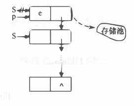

## 第三章 栈与队列

### 3.1 栈定义及特点

栈是用来存储逻辑关系为 "一对一" 数据的线性存储结构，如图所示：

从图 1 我们看到，栈存储结构与之前所学的线性存储结构有所差异，这缘于栈对数据 "存" 和 "取" 的过程有特殊的要求：

1. 栈只能从表的一端存取数据，另一端是封闭的，如图所示；
2. 在栈中，无论是存数据还是取数据，都必须遵循"先进后出"的原则，即最先进栈的元素最后出栈。拿图的栈来说，从图中数据的存储状态可判断出，元素 1 是最先进的栈。因此，当需要从栈中取出元素 1 时，根据"先进后出"的原则，需提前将元素 3 和元素 2 从栈中取出，然后才能成功取出元素 1。

因此，我们可以给栈下一个定义，即**栈是一种只能从表的一端存取数据且遵循 "先进后出" 原则的线性存储结构**。

通常，栈的开口端被称为栈顶；相应地，封口端被称为栈底。因此，栈顶元素指的就是距离栈顶最近的元素，拿图来说，栈顶元素为元素 4；同理，栈底元素指的是位于栈最底部的元素，图中的栈底元素为元素 1。

### 3.2 进栈和出栈

基于栈结构的特点，在实际应用中，通常只会对栈执行以下两种操作：

- 向栈中添加元素，此过程被称为"进栈"（入栈或压栈）；
- 从栈中提取出指定元素，此过程被称为"出栈"（或弹栈）；

### 3.3 栈的具体实现

栈是一种 "特殊" 的线性存储结构，因此栈的具体实现有以下两种方式：

1. **顺序栈**：采用顺序存储结构可以模拟栈存储数据的特点，从而实现栈存储结构；
2. **链栈**：采用链式存储结构实现栈结构；

### 3.4 顺序栈基本操作

**顺序栈**，即用<u>顺序表</u>实现栈存储结构。仔细观察顺序表（底层实现是**数组**）和栈结构就会发现，它们存储数据的方式高度相似，只不过栈对数据的存取过程有特殊的限制，而顺序表没有。

**顺序栈存储结构**如下：

~~~C
typedef struct {
    SElement *base;     //栈底指针
    SElement *top;      //栈顶指针
    int stacksize;      //栈可用最大容量
}SqStack;
~~~

例如，先使用顺序表（a 数组）存储 `{1,2,3,4}`，存储状态如图所示：

同样，使用栈存储结构存储 `{1,2,3,4}`，其存储状态如图所示：

使用顺序表模拟栈结构，只需要将数据从 a 数组下标为 0 的位置依次存储即可。

### 3.5 顺序栈元素"入栈"

1. 判断栈是否满， 若满则返回ERROR。
2. 将新元素压入栈顶， 栈顶指针加1

~~~C++
Status Push(SqStack &S,SElement e){
    //先判断栈是否满， 若满则返回ERROR。
    if (S.top-S.base >= S.stacksize)
        return ERROR;
    //再将新元素压入栈顶， 栈顶指针加1。
    *S.top++ = e;
    
    return OK;
}
~~~

### 3.6 顺序栈的“出栈”

1. 判断栈是否空， 若空则返回ERROR。
2. 栈顶指针减1, 栈顶元素出栈。

~~~C++
Status Pop(SqStack &S,SElement &e){
    //先判断栈是否空， 若空则返回ERROR。
    if (S.top == S.base)
        return ERROR;

    //栈顶指针减1, 栈顶元素出栈。
    e = *--S.top;
    return OK;
}
~~~

---

### 3.7 链栈基本操作

**链栈**，即用<u>链表</u>实现栈存储结构。链栈的实现思路同顺序栈类似，顺序栈是将数顺序表（数组）的一端作为栈底，另一端为栈顶；链栈也如此，通常我们将链表的头部作为栈顶，尾部作为栈底，如图所示：

> 将链表头部作为栈顶的一端，可以避免在实现数据 "入栈" 和 "出栈" 操作时做大量遍历链表的耗时操作。

- 在实现数据"入栈"操作时，需要将数据从链表的头部插入；
- 在实现数据"出栈"操作时，需要删除链表头部的首元节点；

**因此，链栈实际上就是一个只能采用头插法插入或删除数据的链表。**

**链栈存储结构**如下：

~~~C++
typedef struct StackNode{
    Element data;
    struct StackNode *next;
}StackNode,*LinkStack;
~~~

### 3.8 链栈元素入栈

和顺序栈的入栈操作不同的是， 链栈在入栈前不需要判断栈是否满，只需要为入栈元素动态分配 一 个结点空间。

~~~C++
Status Push(LinkStack &S,Element e){
    //为入栈元素 e 分配空间， 用指针 p 指向。
    StackNode *p = new StackNode;
    //将新结点数据域置为e。
    p->data = e;
    //将新结点插入栈顶。
    p->next = S;
    //修改栈顶指针为 p
    S = p;
    return OK;
}
~~~

### 3.9 链栈元素出栈

和顺序栈一样， 链栈在出栈前也需要判断栈是否为空， 不同的是， 链栈在出栈后需要释放出栈元素的栈顶空间。

~~~C++
Status Pop(LinkStack &S,Element &e){
    //判断栈是否为空 ， 若空则返回ERROR。
    if (S == NULL)
        return ERROR;
    //将栈顶元素赋给e。
    e = S->data;
    //临时保存栈顶元素的空间， 以备释放。
    StackNode *p = S;
    //修改栈顶指针， 指向新的栈顶元素。
    S = S->next;
    //释放原栈顶元素的空间。
    delete p;
    return OK;
}
~~~

---

